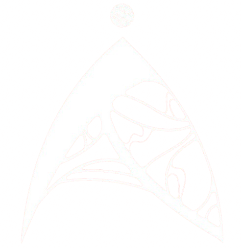
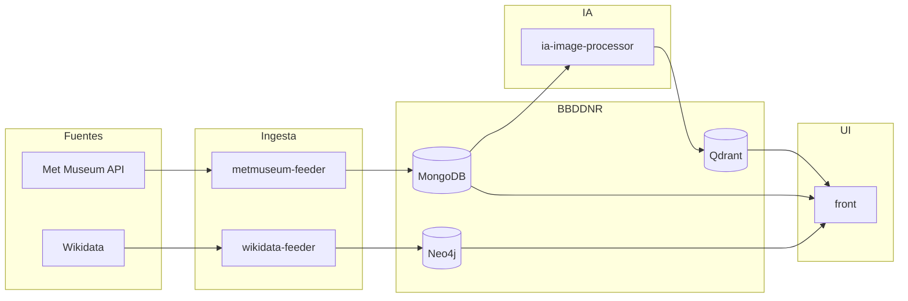

<div align="center">



# Artemis

### *Exploracion de arte con Bases de Datos No Relacionales*

[](https://python.org/)
[](https://www.docker.com/)
[](https://www.mongodb.com/)
[](https://neo4j.com/)
[](https://qdrant.tech/)
[](https://streamlit.io/)

*Proyecto universitario para descubrir obras del Met Museum combinando imagenes, datos documentales y grafos.*

</div>

## 📋 Tabla de contenidos
- [📜 Descripcion](#-descripcion)
- [✨ Caracteristicas](#-caracteristicas)
- [🏗️ Arquitectura](#️-arquitectura)
- [🗃️ Bases de datos no relacionales](#️-bases-de-datos-no-relacionales)
- [🔌 Fuentes de datos](#-fuentes-de-datos)
- [📦 Modulos del sistema](#-modulos-del-sistema)
- [🚀 Instalacion y uso](#-instalacion-y-uso)
- [🔎 Consultas y resultados](#-consultas-y-resultados)
- [🧭 Trabajo futuro](#-trabajo-futuro)
- [👥 Autores](#-autores)
- [📄 Licencia](#-licencia)

## 📜 Descripcion
Artemis es una plataforma para explorar patrimonio cultural del Met Museum. El usuario puede subir una imagen y recibir obras visualmente similares. Luego puede navegar por relaciones como artista, tecnica, movimiento o departamento. El enfoque esta pensado para la asignatura de **Bases de Datos No Relacionales**, mostrando como combinar modelos documentales, de grafos y vectoriales en un mismo proyecto.

## ✨ Caracteristicas
- Busqueda por imagen con similitud visual.
- Contexto historico y semantico mediante un grafo.
- Ingesta automatizada desde fuentes publicas.
- Interfaz sencilla para explorar resultados.
- Arquitectura modular y mantenible.

## 🏗️ Arquitectura
El proyecto sigue una **arquitectura hexagonal (puertos y adaptadores)**. Esta separacion permite cambiar fuentes de datos o tecnologias sin modificar la logica del dominio.



## 🗃️ Bases de datos no relacionales
- **MongoDB (documental):** guarda la ficha completa de cada obra.
- **Neo4j (grafo):** relaciona artistas, tecnicas, movimientos y departamentos.
- **Qdrant (vectorial):** almacena embeddings visuales para la busqueda por similitud.

## 🔌 Fuentes de datos
- **Met Museum API:** datos principales de las obras.
- **Wikidata:** contexto semantico y relaciones culturales.

## 📦 Modulos del sistema
- [metmuseum-feeder](metmuseum-feeder): ingesta documental en MongoDB.
- [wikidata-feeder](wikidata-feeder): enriquecimiento del grafo en Neo4j.
- [ia-image-processor](ia-image-processor): embeddings y carga en Qdrant.
- [front](front): interfaz de usuario en Streamlit.

## 🚀 Instalacion y uso
1) Clonar el repositorio:
```bash
git clone https://github.com/IronHead-SL/Artemis
```

2) Levantar servicios:
```bash
docker compose up -d
```

3) Abrir la interfaz:
```text
http://localhost:8501
```

## 🔎 Consultas y resultados
El sistema permite:
- Buscar obras por similitud visual.
- Ver relaciones del grafo (artista, tecnica, movimiento, pais, institucion).
- Explorar obras relacionadas por contexto cultural.

## 🧭 Trabajo futuro
- Ajustes de rendimiento y escalabilidad.
- Mejora del ranking de resultados.
- Nuevas visualizaciones del grafo.

## 👥 Autores
- Pablo Herrera Gonzalez
- Pablo Cabeza Lantigua

## 📄 Licencia
Este proyecto se distribuye bajo la licencia MIT. Ver [LICENSE](LICENSE).
